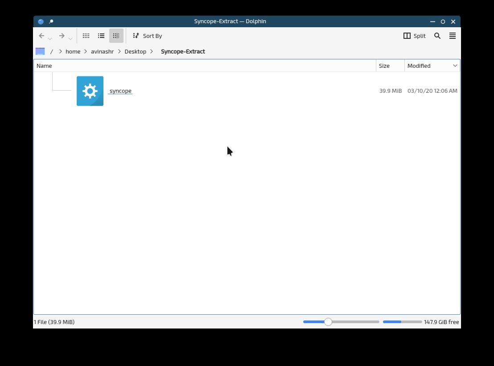
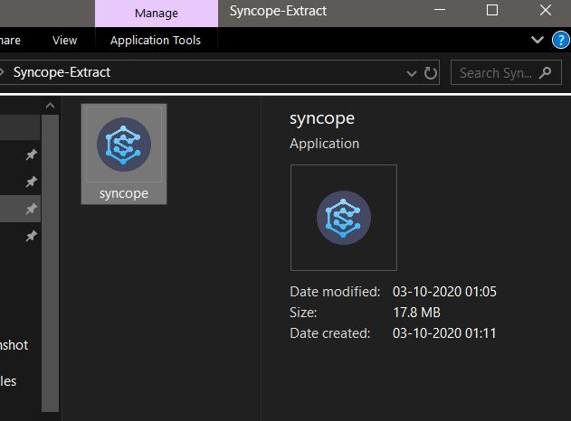
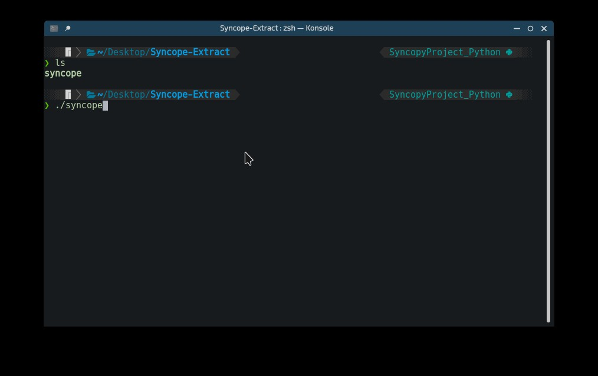
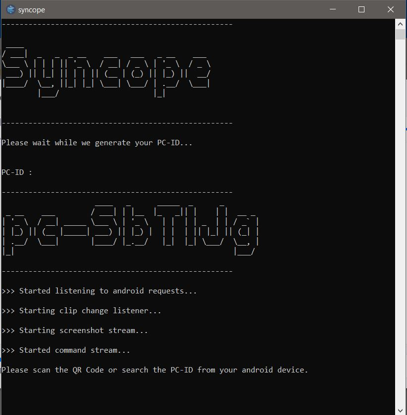

# Syncopé
 Syncopy let you to connect multiple devices together and sync there clipboard.

### You get some advanced features with PC conenctions like :

- Summoning Screenshots from your PC.
-  Executing remote bash commands from anywhere.
- Open up links in your PC in a click from anywhere. 
-  Make your PC repeat whatever you say in voice. 

## Desktop app installation

> Syncopé currently support Windows and Linux OS.

###  1. Download the .zip file for your Operating System 

#### For Linux : [Click here](http://www.mediafire.com/file/g7zpmj93xoubqqe/syncope-linux.zip/file "Linux")

#### For Windows : [Click here](http://www.mediafire.com/file/a2sv5o4qw6npg9a/Syncope-Windows.zip/file "Windows")

### 2. Extract the .zip file, you will find two file-
#### # syncope (Linux) or syncope.exe (Windows)
#### # syncopy-project-firebase*

###### Linux screenshot

###### Windows screenshot

> Note : Never delete or rename "syncopy-project-firebase*"

### 3. This step will be OS specific
#### Linux users : 
1. Open a terminal in the extracted folder.
2. Run `./syncope` 

#### Windows users : 
1. Open the extracted folder.
2. Run `syncope.exe` 

## Wola! You successfully installed Syncopé
